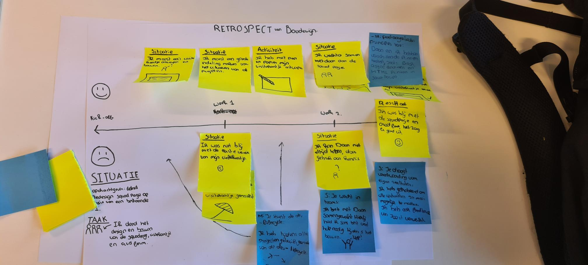

# Sketchnotes Sprint 7 - Connect your tribe.

Dit project omvat twee sketchnotes die ik heb gemaakt tijdens Sprint 7.

### Sketchnote retrospect

Dit is de sketchnote die ik heb gemaakt om mijn progressie in Sprint 7 visueel te maken.

### Sketchnote metafoor

Dit is de sketchnote die ik heb gemaakt om een metafoor te koppelen aan mijn ervaring(en) in Sprint 7. Hierbij stond ik figuurlijk voor paal, omdat mijn kennis in JavaScript toch minder was dan ik had gehoopt.

.jpg)

## 📚 Inhoudsopgave

* [Kenmerken](#kenmerken)
* [Tools](#tools)
* [Licentie](#licentie)

## ⚡ Kenmerken
Dit project is gemaakt met pen & papier. Verder staat hieronder een korte lijst met gebruikte tools en middelen.

**Tools**

- ✍ Pen & Papier

## 🔓 Licentie

This work is licensed under [GNU GPLv3](./LICENSE).
